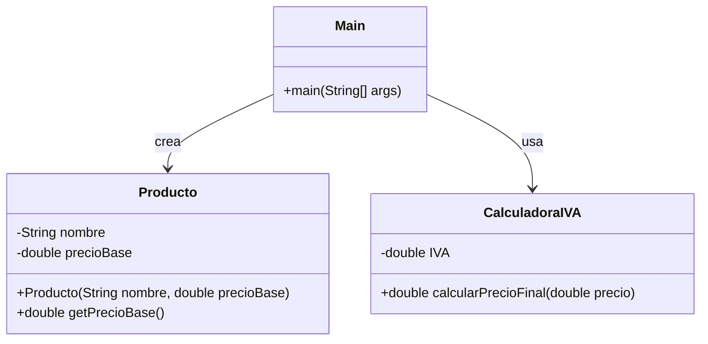
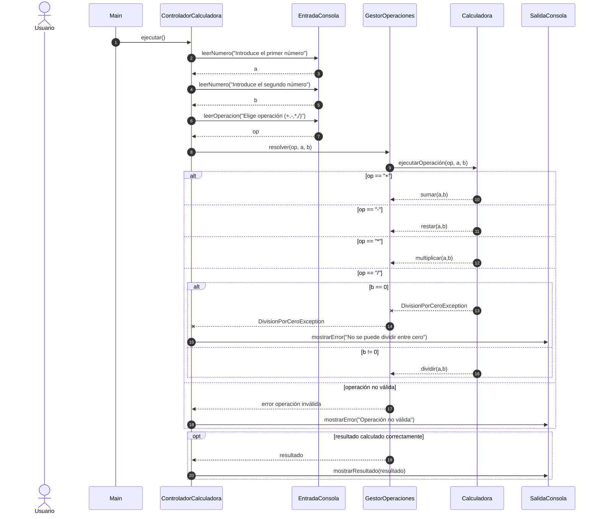
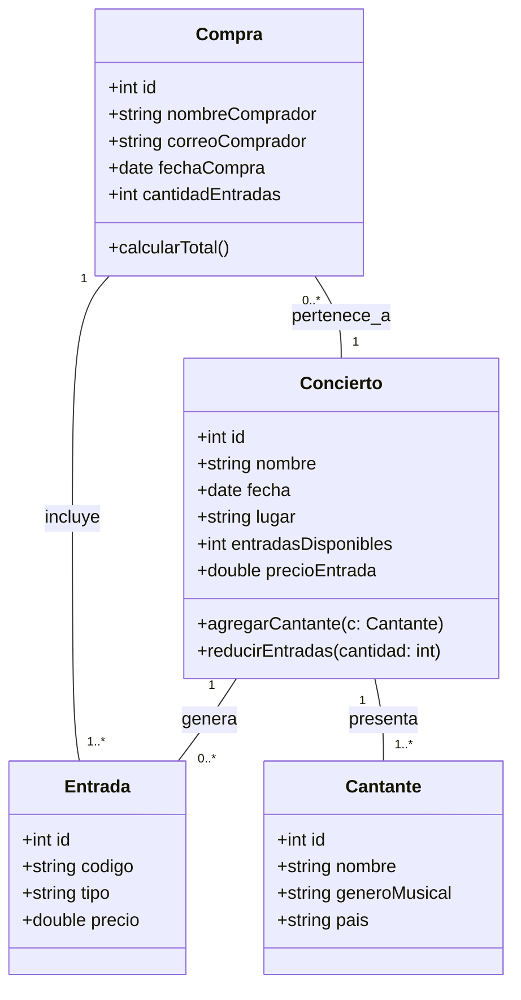

# Documentación - Calculadora Web

## Descripción General

Calculadora web sencilla y funcional desarrollada en HTML, CSS y JavaScript puro. Permite realizar operaciones matemáticas básicas con una interfaz moderna y responsive.bitschips
bitschips
Update uml_avanzado_relaciones.md
f5643be
 · 
Feb 12, 2026
README.md
	
Create README.md
	
Feb 12, 2026
diagrama_primero.md
	
Update diagrama_primero.md
	
Feb 12, 2026
ejercicio_2.md
	
Update ejercicio_2.md
	
Feb 11, 2026
java_code.md
	
Update java_code.md
	
Feb 11, 2026
uml_avanzado_relaciones.md
	
Update uml_avanzado_relaciones.md
	
Feb 12, 2026
Repository files navigation

READM

## Características Principales

### Funcionalidades
- Operaciones aritméticas básicas: suma (+), resta (-), multiplicación (×), división (/)
- Soporte para números decimales
- Función de borrado individual (⌫)
- Función de limpieza total (C)
- Cálculo del resultado (=)
- Manejo de errores en operaciones inválidas

### Interfaz de Usuario
- Diseño moderno con degradado de fondo
- Pantalla de visualización tipo input de solo lectura
- Grid de botones organizados de forma intuitiva
- Efectos visuales al interactuar (hover y active)
- Esquema de colores diferenciado por tipo de botón

## Estructura del Proyecto

El proyecto está contenido en un único archivo HTML que incluye:

1. **HTML**: Estructura de la calculadora
2. **CSS**: Estilos y diseño visual
3. **JavaScript**: Lógica de funcionamiento

## Componentes

### Pantalla
- Campo de texto de solo lecturaDocumento
- Muestra el valor actual o el resultado
- Alineación del texto a la derecha
- Valor inicial: "0"

### Botones

#### Botones Numéricos (0-9)
- Botones para ingresar dígitos del 0 al 9
- Color gris claro (#f0f0f0)

#### Botones de Operadores (+, -, ×, /)
- Color morado (#667eea)
- Texto en blanco
- Ejecutan operaciones aritméticas

#### Botón Igual (=)
- Color morado oscuro (#764ba2)
- Ocupa dos columnas en el grid
- Calcula y muestra el resultado

#### Botón Limpiar (C)
- Color rojo (#ff6b6b)
- Reinicia la pantalla a "0"

#### Botón Borrar (⌫)
- Elimina el último carácter ingresado
- Si solo queda un carácter, reinicia a "0"

#### Botón Decimal (.)
- Permite ingresar números decimales

## Funciones JavaScript

### `agregar(valor)`
**Propósito**: Añade un valor (número u operador) a la pantalla

**Comportamiento**:
- Si la pantalla muestra "0" y el valor no es un punto, reemplaza el "0"
- En caso contrario, concatena el valor al contenido actual

### `limpiar()`
**Propósito**: Reinicia la calculadora

**Comportamiento**:
- Establece el valor de la pantalla en "0"

### `borrar()`
**Propósito**: Elimina el último carácter ingresado

**Comportamiento**:
- Si hay más de un carácter, elimina el último
- Si solo hay un carácter, reinicia a "0"

### `calcular()`
**Propósito**: Evalúa la expresión matemática y muestra el resultado

**Comportamiento**:
- Reemplaza el símbolo "×" por "*" para la evaluación
- Utiliza `eval()` para calcular el resultado
- En caso de error, muestra "Error" por 1.5 segundos y luego reinicia a "0"

## Estilos CSS

### Layout Principal
- Centrado vertical y horizontal con Flexbox
- Fondo con degradado lineal (morado a púrpura)
- Altura mínima de viewport completo

### Contenedor de la Calculadora
- Fondo blanco
- Bordes redondeados (15px)
- Sombra pronunciada para efecto de profundidad
- Padding de 20px

### Grid de Botones
- Sistema de cuadrícula CSS Grid
- 4 columnas de igual tamaño
- Espaciado de 10px entre botones

### Efectos Interactivos
- **Hover**: Cambio de color de fondo y elevación visual
- **Active**: Retorno a posición original al hacer clic

## Diseño Responsive

El diseño utiliza unidades relativas y viewport para adaptarse a diferentes tamaños de pantalla:
- `min-height: 100vh` para ocupar toda la altura
- Anchos en porcentaje (100%)
- Grid flexible con `1fr`

## Consideraciones de Seguridad

⚠️ **Nota Importante**: El código utiliza `eval()` para evaluar expresiones matemáticas. En un entorno de producción, se recomienda:
- Implementar un parser de expresiones matemáticas más seguro
- Validar las entradas antes de procesarlas
- Evitar el uso de `eval()` con datos del usuario

## Uso

### Para el Usuario Final
1. Hacer clic en los números para ingresar valores
2. Seleccionar un operador (+, -, ×, /)
3. Ingresar el segundo número
4. Presionar "=" para ver el resultado
5. Usar "C" para reiniciar o "⌫" para borrar el último dígito

### Para Desarrolladores
1. Copiar el código en un archivo con extensión `.html`
2. Abrir el archivo en cualquier navegador web moderno
3. No requiere servidor web ni dependencias externas

## Navegadores Compatibles

- Chrome/Edge (versiones modernas)
- Firefox (versiones modernas)
- Safari (versiones modernas)
- Opera (versiones modernas)

## Posibles Mejoras Futuras

1. **Funcionalidad**
   - Agregar operaciones avanzadas (raíz cuadrada, potencias, porcentajes)
   - Historial de operaciones
   - Modo científico
   - Soporte para teclado físico

2. **Diseño**
   - Temas claro/oscuro
   - Personalización de colores
   - Animaciones más sofisticadas

3. **Código**
   - Refactorizar para usar clases de JavaScript
   - Implementar tests unitarios
   - Mejorar la validación de entradas
   - Reemplazar `eval()` por una solución más segura

## Mantenimiento

### Modificar Colores
Los colores están definidos en las clases CSS y se pueden cambiar fácilmente:
- `.operador`: Botones de operadores
- `.igual`: Botón de igual
- `.limpiar`: Botón de limpiar
- `background` de `body`: Fondo degradado

### Añadir Funciones
Para agregar nuevas funciones:
1. Crear un nuevo botón en el HTML
2. Asignar una función `onclick`
3. Implementar la lógica en JavaScript

## Licencia

Este proyecto es de código abierto y puede ser utilizado libremente para fines educativos y comerciales.

## Contacto y Soporte

Para reportar bugs o sugerir mejoras, contactar al equipo de desarrollo.

---

**Última actualización**: Febrero 2026
**Versión**: 1.0

